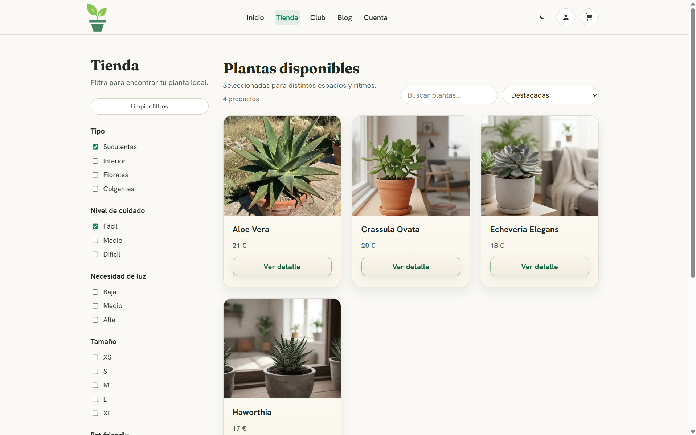
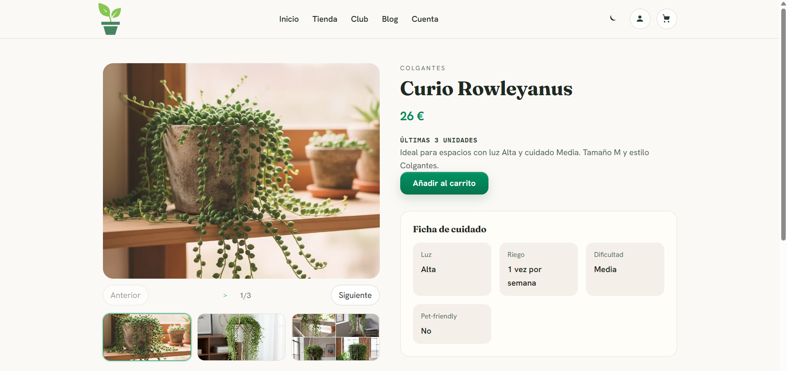
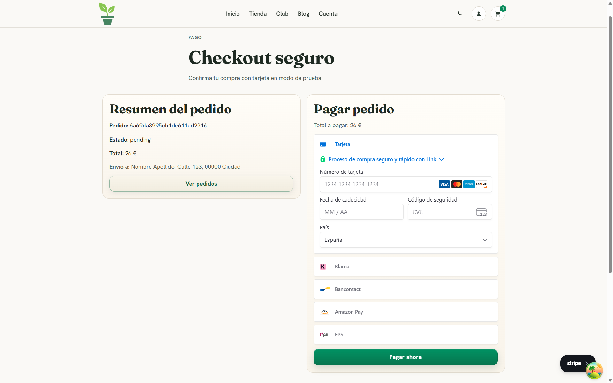
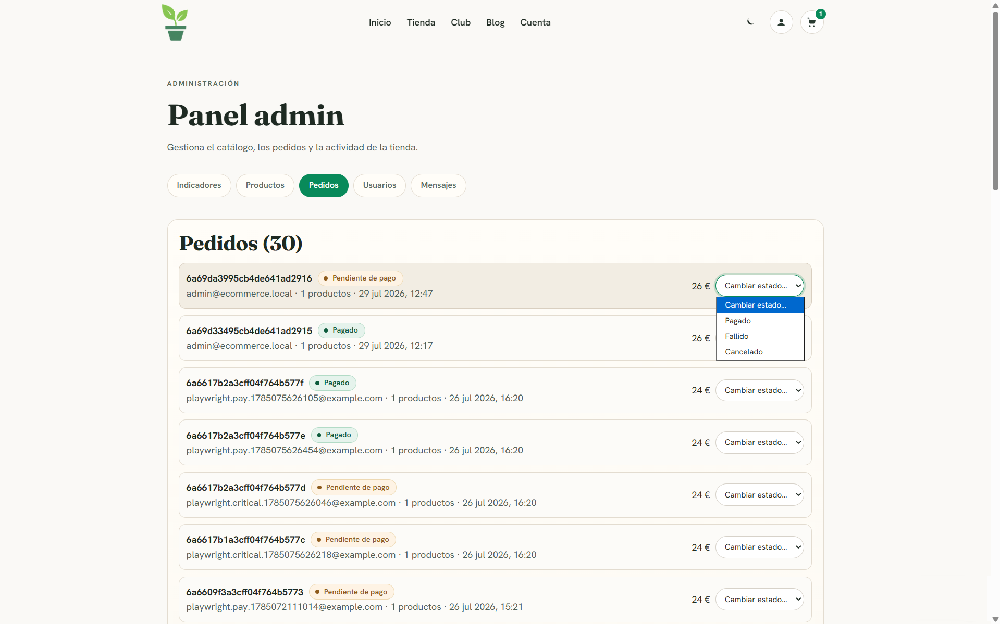
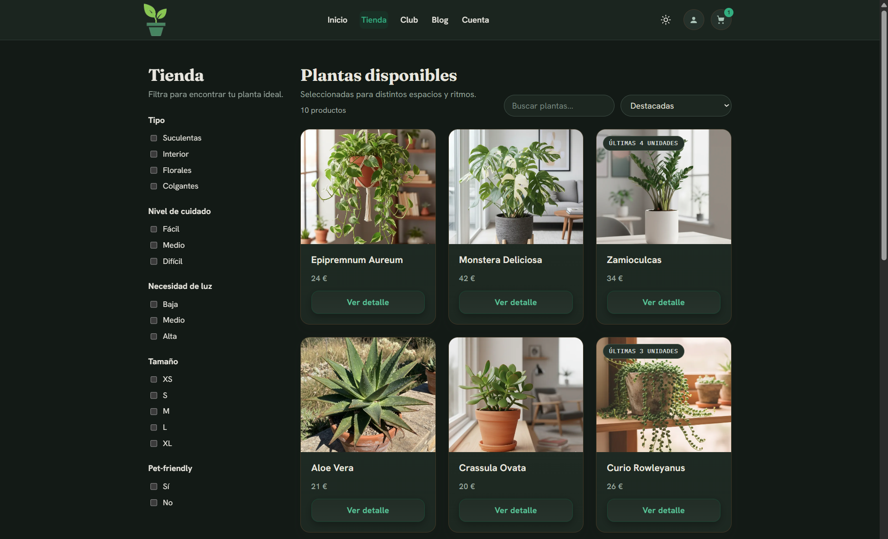
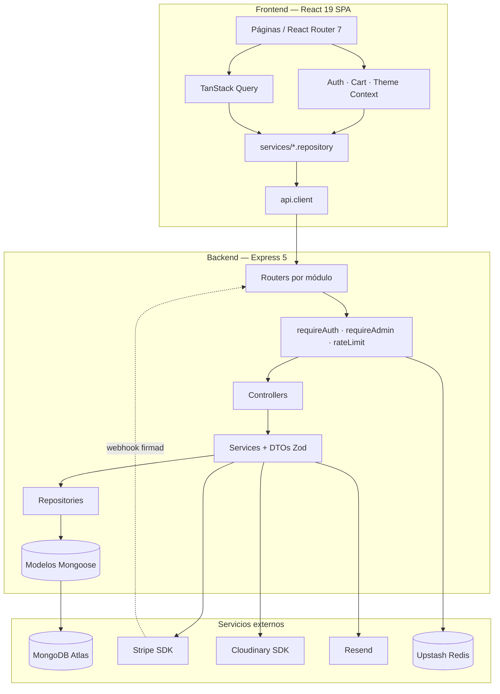

# Ecommerce Web

Tienda de plantas online full-stack. Monorepo con API REST en **Node + Express 5 + TypeScript** sobre **MongoDB**, y SPA en **React 19 + Vite**. Proyecto desplegado en Vercel.


**Demo:** _(URL de Vercel)_ · **API docs:** `/api/docs`

---

## La idea

Tienda de plantas de interior. El catálogo se filtra por tipo, nivel de cuidado, luz requerida, tamaño y si son aptas para mascotas. El usuario se registra, añade al carrito, introduce una dirección de envío y paga con tarjeta. Un panel de administración permite gestionar el catálogo, revisar pedidos y avanzarlos por sus estados.

El dominio se eligió porque tiene los atributos suficientes para justificar filtros combinables y variación de stock real, sin necesitar variantes de producto (tallas, colores) que habrían complicado el modelo sin aportar nada técnicamente distinto.

---

## Capturas

| Home                               | Tienda con filtros                   |
| ---------------------------------- | ------------------------------------ |
|  |  |

| Ficha de producto                         | Checkout                                   |
| ----------------------------------------- | ------------------------------------------ |
|  |  |

| Panel de administración              | Tema oscuro                                    |
| ------------------------------------ | ---------------------------------------------- |
|  |  |

---

## Stack

| Capa            | Tecnología                            | Motivo                                                                 |
| --------------- | ------------------------------------- | ---------------------------------------------------------------------- |
| Frontend        | React 19 + Vite 7 + TypeScript        | SPA, HMR, tipado estricto sin `any`                                    |
| Estado servidor | TanStack Query 5                      | Caché, revalidación y deduplicación de peticiones                      |
| Estado cliente  | Context API                           | Sesión, carrito y tema: estado pequeño, sin necesidad de store externo |
| Estilos         | CSS Modules + design tokens           | Encapsulado por componente, tematizable desde una única fuente         |
| Backend         | Node + Express 5 + TypeScript         | API REST modular por dominio                                           |
| Datos           | MongoDB + Mongoose 9                  | Documentos flexibles; transacciones sobre replica set                  |
| Pagos           | Stripe (PaymentIntent + webhook)      | Confirmación asíncrona verificada por firma                            |
| Media           | Cloudinary                            | Almacenamiento y transformación de imágenes                            |
| Rate limit      | Upstash Redis, fallback en memoria    | Contadores compartidos entre instancias serverless                     |
| Tests           | Vitest + Testing Library + Playwright | Unitario, integración y e2e                                            |
| Deploy          | Vercel                                | Frontend estático + backend serverless                                 |

---

## Arquitectura



El flujo es unidireccional en ambos lados. En el backend ninguna capa salta a la siguiente: un controller nunca toca Mongoose directamente, siempre pasa por el service y el repository. En el frontend los componentes nunca llaman a `fetch`, sino a un repositorio a través de `api.client`, que centraliza el token, el refresco de sesión y el mapeo de errores.

### Estructura

```
ecommerce-web/
├── backend/            # API REST — ver backend/README.md
├── frontend/           # SPA — ver frontend/README.md
├── .github/workflows/  # ci.yml (calidad + e2e), codeql.yml
├── docker-compose.yml  # MongoDB (replica set) + Redis para desarrollo
└── package.json        # scripts que orquestan ambos paquetes
```

---

## Puesta en marcha

### Requisitos

- Node **≥ 22.12** (hay `.nvmrc`).
- MongoDB **como replica set** — las transacciones del flujo de pago lo exigen. Dos opciones:
  - `npm run dev:services` (Docker: Mongo con replica set ya inicializado + Redis), o
  - una cuenta de MongoDB Atlas.
- Stripe, Cloudinary, Upstash y Resend son opcionales: sin sus credenciales las funciones asociadas degradan de forma controlada en vez de romper el arranque.

### Instalación

No hay npm workspaces: cada paquete instala por separado.

```bash
npm install
npm install --prefix backend
npm install --prefix frontend
```

### Variables de entorno

```bash
cp backend/.env.example backend/.env
cp frontend/.env.example frontend/.env
```

Mínimo para arrancar en desarrollo: `MONGODB_URI`, `MONGODB_DB_NAME`, `JWT_ACCESS_SECRET`, `JWT_REFRESH_SECRET` (los dos secretos, mínimo 16 caracteres). El detalle completo está en los README de cada paquete.

### Datos de ejemplo y arranque

```bash
npm run dev:services                     # Mongo + Redis en Docker
npm run seed:products --prefix backend   # catálogo
npm run seed:admin --prefix backend      # usuario administrador
npm run dev                              # backend :4000 + frontend :5173
```

- Tienda: `http://localhost:5173`
- API: `http://localhost:4000/api`
- Documentación interactiva: `http://localhost:4000/api/docs`

### Webhook de Stripe (opcional)

```bash
stripe listen --forward-to localhost:4000/api/payments/webhook
```

El secreto que imprime este comando es el que va en `STRIPE_WEBHOOK_SECRET` para desarrollo.

---

## Scripts

Desde la raíz, orquestan ambos paquetes:

| Script                                       | Qué hace                                        |
| -------------------------------------------- | ----------------------------------------------- |
| `npm run dev`                                | Backend y frontend en paralelo (`concurrently`) |
| `npm run typecheck`                          | `tsc` en ambos paquetes                         |
| `npm run lint`                               | ESLint en ambos                                 |
| `npm run test`                               | Tests unitarios y de integración                |
| `npm run build`                              | Compila backend y frontend                      |
| `npm run format` / `format:check`            | Prettier                                        |
| `npm run quality`                            | typecheck + lint + format:check + test          |
| `npm run deploy:check`                       | `quality` + build — el gate previo a desplegar  |
| `npm run dev:services` / `dev:services:stop` | Levanta o detiene Mongo y Redis                 |

---

## Testing

| Suite    | Comando                              | Cobertura             |
| -------- | ------------------------------------ | --------------------- |
| Backend  | `npm run test --prefix backend`      | 75 tests, 12 ficheros |
| Frontend | `npm run test --prefix frontend`     | 52 tests, 12 ficheros |
| E2E      | `npm run test:e2e --prefix frontend` | 14 tests, 3 specs     |

Los tests de backend levantan `mongodb-memory-server` **como replica set**, así que corren sin `.env`, sin base de datos externa y sin red — requisito para que la CI no necesite secretos. Stripe se mockea en los tests unitarios; el e2e sí usa Stripe en modo test real.

Los e2e necesitan backend y frontend en marcha, y la primera vez `npm run test:e2e:install --prefix frontend` para descargar Chromium.

---

## Decisiones técnicas

- **Los precios se revalidan al crear el pedido.** El carrito congela el precio al añadir el producto; al crear el pedido se relee el catálogo y se recalculan líneas y total. El importe que llega a Stripe nunca procede de un precio obsoleto en el carrito.

- **El stock se descuenta al confirmar el pago, no antes.** Añadir al carrito y crear el pedido solo comprueban disponibilidad. Hasta que Stripe confirma, la venta no existe, así que un carrito abandonado no bloquea inventario.

- **La confirmación del pago es transaccional.** Marcar el pedido como pagado, descontar stock y vaciar el carrito son una unidad atómica. Como las transacciones de MongoDB exigen replica set, `config/transactions.ts` detecta la capacidad una sola vez y, si no la hay (Mongo standalone en local), ejecuta sin sesión dejando un aviso en el log en lugar de fallar.

- **El webhook es idempotente.** Cada `event.id` de Stripe se persiste con índice único. Una reentrega del mismo evento no vuelve a descontar stock.

- **Sesiones revocables mediante `tokenVersion`.** El access token incluye una versión que `requireAuth` contrasta con la base de datos en cada petición autenticada. Cuesta una consulta por petición, y a cambio permite invalidar sesiones al instante (logout global, cambio de rol, detección de reutilización de refresh token).

- **Baja lógica de productos.** `DELETE /admin/products/:id` marca `isActive: false`. Los pedidos históricos referencian el producto y no pueden quedar apuntando a un documento inexistente.

- **Context API + TanStack Query en lugar de un store externo.** El estado de cliente (sesión, tema) es pequeño y los contexts memoizan su valor. El problema real era la ausencia de caché de servidor, que resuelve Query. `CartContext` quedó como fachada sobre Query manteniendo su API pública.

- **El presupuesto de rendimiento se mide en gzip.** Es lo que descarga el usuario y lo que sirve Vercel. Los límites en crudo se conservan como techo secundario.

- **El refresh token vive en `localStorage`.** Queda expuesto a XSS. La alternativa (cookie `httpOnly`) se complica por el split de origen entre frontend y backend en Vercel. Decisión asumida conscientemente, no un descuido.

---

## Despliegue

Frontend y backend se despliegan como **dos proyectos de Vercel independientes** sobre el mismo repo (`Root Directory` distinto en cada uno: `frontend` y `backend`), no como un monorepo con `vercel.json` — Vercel deprecó ese modelo (`experimentalServices`) para proyectos nuevos. El backend usa la detección zero-config de Express (`export default app` en `backend/src/app.ts`); el frontend, la de Vite. La CI (`.github/workflows/ci.yml`) ejecuta dos jobs: **calidad** (formato, lint, typecheck, tests, build y presupuesto de rendimiento) y **e2e** (levanta Mongo como replica set, siembra el catálogo, arranca el backend y corre Playwright). CodeQL se ejecuta en un workflow aparte.

Antes de desplegar:

1. Configurar las variables de entorno de producción en cada proyecto de Vercel — el backend valida en el arranque que existan las obligatorias (`MONGODB_URI`, `JWT_*`, `CLOUDINARY_*`, `STRIPE_*`) y rechaza `CORS_ORIGIN=*`.
2. En el proyecto del frontend, `VITE_API_BASE_URL` debe apuntar al dominio del proyecto del backend (p. ej. `https://ecommerce-web-backend.vercel.app/api`); en el del backend, `CORS_ORIGIN` debe apuntar al dominio del frontend.
3. Regenerar el sitemap con la URL real: `npm run seo:sitemap --prefix frontend` con `VITE_SITE_URL` apuntando al dominio de producción.
4. Dar de alta el endpoint del webhook en el dashboard de Stripe (URL del backend + `/api/payments/webhook`) y usar ese secreto de firma.

---
