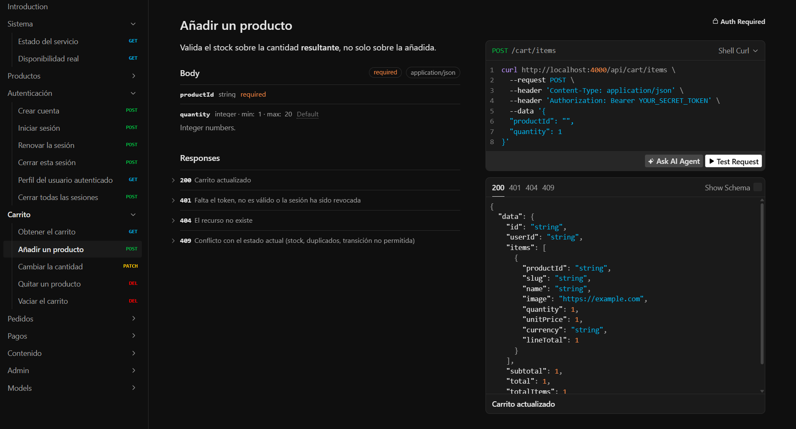

# Backend — Ecommerce Web API

API REST en Node + Express 5 + TypeScript sobre MongoDB. Parte del monorepo [ecommerce-web](../README.md).

```bash
npm install
cp .env.example .env
npm run dev                # tsx watch en :4000
```

Documentación interactiva: `http://localhost:4000/api/docs` · Especificación OpenAPI 3.1: `/api/openapi.json`

---

## Arquitectura por capas

Cada petición atraviesa las capas en un solo sentido. Ninguna capa salta a la siguiente: un controller nunca usa Mongoose directamente.

```
routes → middlewares → controller → service → repository → schema (Mongoose)
```

| Capa          | Responsabilidad                                                     |
| ------------- | ------------------------------------------------------------------- |
| `routes`      | Declara endpoints y encadena middlewares (auth, rate limit, multer) |
| `middlewares` | `requireAuth`, `requireAdmin`, limitadores por ruta                 |
| `controller`  | Traduce HTTP ↔ dominio. No contiene lógica de negocio               |
| `service`     | Reglas de negocio. Valida la entrada con DTOs de Zod                |
| `repository`  | Acceso a datos. Aísla las consultas de Mongoose                     |
| `schema`      | Modelo, índices y tipos del documento                               |

Los 8 módulos siguen el mismo patrón:

```
modules/<dominio>/
├── <dominio>.routes.ts
├── controllers/
├── services/
├── repositories/
├── schemas/
└── dto/
```

`auth` · `products` · `cart` · `orders` · `payments` · `content` · `admin` · `notifications`

`notifications` es la excepción: solo expone un servicio de email (Resend), sin rutas propias — lo consume `payments` al confirmar un pedido.



---

## Endpoints

Todos cuelgan de `API_PREFIX` (por defecto `/api`).

### Autenticación

| Método | Ruta               | Auth    | Descripción                                           |
| ------ | ------------------ | ------- | ----------------------------------------------------- |
| `POST` | `/auth/register`   | —       | Alta de usuario. Devuelve access + refresh            |
| `POST` | `/auth/login`      | —       | Inicio de sesión                                      |
| `POST` | `/auth/refresh`    | —       | Rota el refresh token y emite un access nuevo         |
| `POST` | `/auth/logout`     | —       | Revoca la sesión del refresh token enviado            |
| `GET`  | `/auth/me`         | Usuario | Perfil de la sesión activa                            |
| `POST` | `/auth/logout-all` | Usuario | Revoca todas las sesiones (incrementa `tokenVersion`) |

### Catálogo

| Método | Ruta                    | Auth | Descripción                                       |
| ------ | ----------------------- | ---- | ------------------------------------------------- |
| `GET`  | `/products`             | —    | Listado con filtros, búsqueda, orden y paginación |
| `GET`  | `/products/featured`    | —    | Destacados para la home                           |
| `GET`  | `/products/related/:id` | —    | Relacionados por categoría                        |
| `GET`  | `/products/slug/:slug`  | —    | Ficha por slug                                    |
| `GET`  | `/products/:id`         | —    | Ficha por id                                      |

Query params de `/products`: `category`, `careLevel`, `lightLevel`, `size` (todos multivalor: repetidos o separados por coma), `petFriendly` (booleano), `q` (texto, máx. 120), `sort` (`featured` \| `price_asc` \| `price_desc`), `page`, `limit`.

### Carrito

Todas requieren sesión de usuario.

| Método   | Ruta                     | Descripción                   |
| -------- | ------------------------ | ----------------------------- |
| `GET`    | `/cart`                  | Carrito del usuario           |
| `POST`   | `/cart/items`            | Añade producto (valida stock) |
| `PATCH`  | `/cart/items/:productId` | Cambia cantidad               |
| `DELETE` | `/cart/items/:productId` | Elimina una línea             |
| `DELETE` | `/cart/clear`            | Vacía el carrito              |

### Pedidos y pagos

| Método | Ruta                | Auth         | Descripción                                               |
| ------ | ------------------- | ------------ | --------------------------------------------------------- |
| `POST` | `/orders`           | Usuario      | Crea el pedido desde el carrito. Revalida precios y stock |
| `GET`  | `/orders`           | Usuario      | Pedidos del usuario, paginados                            |
| `GET`  | `/orders/:id`       | Usuario      | Detalle (solo si es propietario)                          |
| `POST` | `/payments/intents` | Usuario      | Crea o recupera el PaymentIntent del pedido               |
| `POST` | `/payments/webhook` | Firma Stripe | Confirma el pago. Idempotente                             |

### Contenido

| Método | Ruta                    | Auth | Descripción                  |
| ------ | ----------------------- | ---- | ---------------------------- |
| `GET`  | `/blog`                 | —    | Listado de artículos         |
| `GET`  | `/blog/:slug`           | —    | Artículo por slug            |
| `POST` | `/contact/messages`     | —    | Formulario de contacto       |
| `POST` | `/newsletter/subscribe` | —    | Alta en newsletter           |
| `POST` | `/club/leads`           | —    | Lead del club de suscripción |

### Administración

Todas requieren rol `admin`.

| Método   | Ruta                                   | Descripción                                             |
| -------- | -------------------------------------- | ------------------------------------------------------- |
| `GET`    | `/admin/stats`                         | Ingresos, pedidos por estado, top productos, stock bajo |
| `GET`    | `/admin/products`                      | Catálogo completo, incluidos los dados de baja          |
| `POST`   | `/admin/products`                      | Alta de producto                                        |
| `PATCH`  | `/admin/products/:id`                  | Edición                                                 |
| `DELETE` | `/admin/products/:id`                  | Baja lógica (`isActive: false`)                         |
| `POST`   | `/admin/products/:id/images`           | Sube imagen a Cloudinary (`multipart`, campo `image`)   |
| `DELETE` | `/admin/products/:id/images/:publicId` | Elimina imagen                                          |
| `GET`    | `/admin/orders`                        | Todos los pedidos con datos del comprador               |
| `PATCH`  | `/admin/orders/:id/status`             | Avanza el estado, validando la transición               |
| `GET`    | `/admin/users`                         | Usuarios y su número de pedidos                         |
| `GET`    | `/admin/contact-messages`              | Mensajes recibidos                                      |
| `GET`    | `/admin/club-leads`                    | Leads del club                                          |

---

## Modelo de datos

| Colección                                                        | Contenido relevante                                                            |
| ---------------------------------------------------------------- | ------------------------------------------------------------------------------ |
| `User`                                                           | Credenciales (hash `bcryptjs`), `role`, `tokenVersion`, sesiones de refresh    |
| `Product`                                                        | Slug, precio, stock, atributos de filtrado, imágenes de Cloudinary, `isActive` |
| `Cart`                                                           | Un carrito por usuario. Congela precio unitario al añadir                      |
| `Order`                                                          | Líneas, dirección, `status`, `paymentIntentId`, `paidAt`, `paymentLastError`   |
| `ProcessedWebhookEvent`                                          | `event.id` de Stripe con índice único — garantiza idempotencia                 |
| `BlogPost`, `ContactMessage`, `NewsletterSubscriber`, `ClubLead` | Contenido y captación                                                          |

### Máquina de estados del pedido

```
pending ──> paid ──> processing ──> shipped ──> delivered
   │          │
   ├──> failed
   └──> canceled <──┘
```

Definida en `modules/orders/schemas/order.schema.ts` como `ALLOWED_STATUS_TRANSITIONS`. `delivered`, `failed` y `canceled` son terminales. El endpoint de administración rechaza cualquier transición no declarada, así que el estado no puede retroceder ni saltar pasos.

---

## Autenticación

Doble token:

- **Access token** (`15m` por defecto): viaja en `Authorization: Bearer`. Incluye `sub`, `role` y `tokenVersion`.
- **Refresh token** (`7d`): rotatorio. Cada uso emite uno nuevo e invalida el anterior.

`requireAuth` verifica la firma y además **contrasta el `tokenVersion` del token con el de la base de datos**. Cuesta una consulta por petición autenticada y a cambio permite revocar sesiones de forma inmediata: `logout-all`, un cambio de rol o la detección de reutilización de un refresh token ya consumido incrementan `tokenVersion` y todos los access tokens vivos dejan de valer al instante.

Se admiten hasta 5 sesiones simultáneas por usuario; al superarlas se descarta la más antigua.

---

## Flujo de pago

1. `POST /orders` — se crea el pedido en `pending`. **Se releen los productos del catálogo** y se recalculan líneas y total: el carrito no es la fuente de verdad del precio. Se valida stock, pero no se descuenta.
2. `POST /payments/intents` — se crea el PaymentIntent en Stripe con clave de idempotencia derivada del pedido y el importe. Devuelve el `client_secret` al frontend.
3. El usuario paga con Stripe Elements en el navegador.
4. `POST /payments/webhook` — Stripe notifica el resultado. Se verifica la firma con `STRIPE_WEBHOOK_SECRET` sobre el **cuerpo crudo** (por eso esta ruta se monta antes del parser JSON). Si `event.id` ya está registrado, se responde 200 sin reprocesar.
5. Confirmado el pago, en una **transacción**: se marca el pedido `paid`, se descuenta el stock y se vacía el carrito. Después se envía el email de confirmación.

El stock se descuenta en el paso 5, nunca antes: hasta que Stripe confirma, la venta no existe.

---

## Rate limiting

`RATE_LIMIT_STORE` selecciona el backend del contador:

- `memory` — por instancia. Suficiente en desarrollo.
- `upstash` — Redis compartido, necesario en serverless, donde cada invocación puede caer en una instancia distinta. Si Upstash falla, degrada a memoria en lugar de rechazar la petición.

Los límites se aplican por ruta según su coste y su riesgo: escritura de autenticación (registro, login, refresh) es la más restrictiva, seguida de creación de pedidos e intents; la lectura de catálogo es la más permisiva.

---

## Variables de entorno

| Variable                                             | Obligatoria     | Por defecto      | Notas                                                                                       |
| ---------------------------------------------------- | --------------- | ---------------- | ------------------------------------------------------------------------------------------- |
| `NODE_ENV`                                           | —               | `development`    |                                                                                             |
| `PORT`                                               | —               | `4000`           |                                                                                             |
| `API_PREFIX`                                         | —               | `/api`           |                                                                                             |
| `CORS_ORIGIN`                                        | En producción   | `*`              | Lista separada por comas. En producción se rechaza `*`, exige `https` y prohíbe `localhost` |
| `MONGODB_URI`                                        | En producción   | —                | Replica set requerido para transacciones                                                    |
| `MONGODB_DB_NAME`                                    | En producción   | —                |                                                                                             |
| `JWT_ACCESS_SECRET`                                  | En producción   | —                | Mínimo 16 caracteres                                                                        |
| `JWT_REFRESH_SECRET`                                 | En producción   | —                | Mínimo 16 caracteres                                                                        |
| `JWT_ACCESS_EXPIRES_IN`                              | —               | `15m`            |                                                                                             |
| `JWT_REFRESH_EXPIRES_IN`                             | —               | `7d`             |                                                                                             |
| `CLOUDINARY_CLOUD_NAME` / `_API_KEY` / `_API_SECRET` | En producción   | —                | Sin ellas, la subida de imágenes responde 503                                               |
| `CLOUDINARY_FOLDER`                                  | —               | `ecommerce-web`  |                                                                                             |
| `STRIPE_SECRET_KEY`                                  | En producción   | —                |                                                                                             |
| `STRIPE_WEBHOOK_SECRET`                              | En producción   | —                | Firma del webhook                                                                           |
| `RATE_LIMIT_STORE`                                   | —               | `memory`         | `memory` \| `upstash`                                                                       |
| `RATE_LIMIT_PREFIX`                                  | —               | `ecommerce-web`  |                                                                                             |
| `UPSTASH_REDIS_REST_URL` / `_TOKEN`                  | Si `upstash`    | —                |                                                                                             |
| `EMAIL_ENABLED`                                      | —               | `false`          | Si no es `true`, el email se registra en el log                                             |
| `RESEND_API_KEY`                                     | Si email activo | —                |                                                                                             |
| `EMAIL_FROM`                                         | —               | —                |                                                                                             |
| `LOG_LEVEL`                                          | —               | `debug` / `info` | En `test` es `silent`                                                                       |

`config/env.ts` valida el conjunto con Zod al arrancar. En producción comprueba además que las obligatorias existan y no estén vacías: el proceso no levanta con una configuración incompleta.

---

## Scripts

| Script                         | Qué hace                                    |
| ------------------------------ | ------------------------------------------- |
| `npm run dev`                  | Servidor con recarga (`tsx watch`)          |
| `npm run build` / `start`      | Compila a `dist/` / arranca la build        |
| `npm run typecheck`            | `tsc --noEmit`                              |
| `npm run lint`                 | ESLint                                      |
| `npm run test`                 | Vitest con MongoDB en memoria               |
| `npm run test:coverage`        | Cobertura                                   |
| `npm run seed:products`        | Siembra el catálogo                         |
| `npm run seed:content`         | Siembra artículos del blog                  |
| `npm run seed:admin`           | Crea el usuario administrador               |
| `npm run demo:prepare`         | Reinicia y siembra todo el conjunto de demo |
| `npm run smoke:all`            | Smoke tests contra un servidor en marcha    |
| `npm run migrate:sessions`     | Migra el modelo de sesiones (una sola vez)  |
| `npm run assets:cloudinary:ia` | Inventaría y sube los assets a Cloudinary   |

---

## Tests

```bash
npm run test
```

12 ficheros, 75 tests. Levantan `mongodb-memory-server` **como replica set**, de modo que las transacciones se ejercitan de verdad y la suite **no necesita `.env`, base de datos externa ni red**. Stripe y Cloudinary se mockean; `tests/setup.ts` fuerza sus variables a cadena vacía para que un `.env` real del desarrollador no altere el resultado (hay un test que verifica precisamente la respuesta 503 cuando Cloudinary no está configurado).

Cubren: autenticación y rotación de sesiones, catálogo y filtros, carrito, pedidos y stock, panel de administración, webhook de pagos, email y validación del contrato OpenAPI.

---

## Notas de operación

- Las transacciones exigen replica set. Sin él, `config/transactions.ts` detecta la carencia una vez y ejecuta sin sesión dejando un aviso — no rompe el flujo de pago en desarrollo.
- La ruta del webhook se monta **antes** del parser JSON: la verificación de firma necesita el cuerpo sin procesar.
- `npm run migrate:sessions` debe ejecutarse una vez contra la base de datos antes del primer despliegue posterior a la introducción de las sesiones múltiples. Es idempotente.
- Las imágenes se suben con `multer` en memoria (nunca a disco) y se reenvían a Cloudinary — necesario en serverless, donde el sistema de ficheros es efímero.
