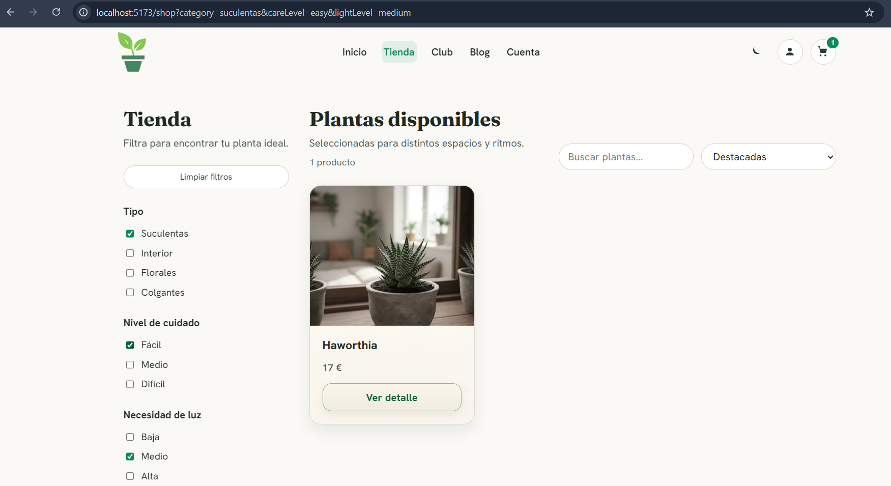
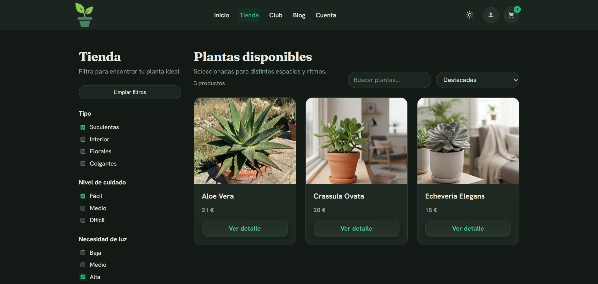
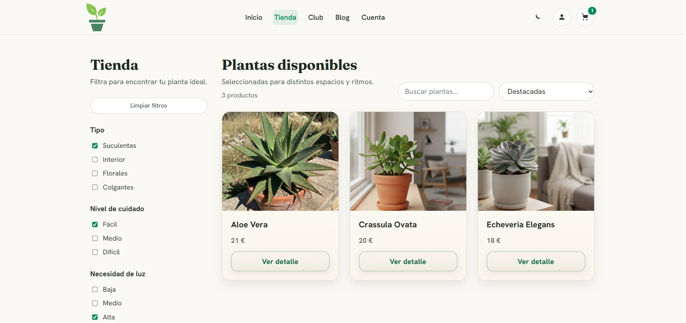

# Frontend — Ecommerce Web

SPA en React 19 + Vite 7 + TypeScript. Parte del monorepo [ecommerce-web](../README.md).

```bash
npm install
cp .env.example .env
npm run dev                # Vite en :5173
```

Necesita el backend en marcha en `:4000` (o ajustar `VITE_API_BASE_URL`).

---

## Organización

```
src/
├── pages/          # una carpeta por ruta: .tsx + .module.css
├── components/
│   ├── layout/     # Header, Footer
│   ├── routing/    # guardas de ruta (ProtectedRoute, AdminRoute)
│   ├── common/     # ErrorBoundary, RouteFallback
│   ├── sections/   # bloques de página (Hero, ProductGrid, …)
│   └── ui/         # piezas reutilizables (ProductCard, OrderCard, Skeletons, …)
├── features/       # hooks de TanStack Query por dominio (products, cart)
├── store/          # Context: Auth, Cart, Theme
├── services/       # api.client + un repositorio por dominio
├── hooks/          # useFocusTrap
├── utils/          # format, order, stock, shipping, seo, jsonLd, motion
├── lib/            # queryClient
└── index.css       # design tokens, tema oscuro y estilos globales
```

La dependencia va siempre en el mismo sentido: `page → component → hook/context → repository → api.client`. Ningún componente llama a `fetch` directamente.

---

## Estado: dos sistemas con fronteras claras

| Tipo de estado | Dónde vive     | Ejemplos                   |
| -------------- | -------------- | -------------------------- |
| **Servidor**   | TanStack Query | catálogo, carrito, pedidos |
| **Cliente**    | Context API    | sesión, tema               |

Query aporta caché, deduplicación de peticiones en vuelo, revalidación e invalidación tras mutación. El estado de cliente es pequeño y los contexts memoizan su valor, así que no se introdujo un store externo.

`CartContext` es una **fachada sobre TanStack Query**: mantiene su API pública (`addItem`, `updateItem`, `removeItem`, `clear`) mientras la caché y la sincronización las gestiona Query por debajo. Los componentes que lo consumían no cambiaron.

### Sesión

`AuthContext` guarda access y refresh token y programa la renovación **antes** de que el access expire. Además valida la sesión al montar: si el backend responde 401 porque la sesión fue revocada en remoto (logout global, cambio de rol, reutilización de refresh token detectada), limpia el estado local en lugar de dejar al usuario con una sesión fantasma que fallaría en cada petición.

---

## Rutas

React Router 7. Hay 20 rutas declaradas. **Todas las vistas salvo la Home se cargan con `lazy()` + `Suspense`**, de modo que cada una es un chunk independiente; la Home se importa de forma estática por ser la ruta de entrada, para no añadirle un salto de carga innecesario.

| Ruta                                                                        | Vista                        | Acceso  |
| --------------------------------------------------------------------------- | ---------------------------- | ------- |
| `/`                                                                         | Home                         | Público |
| `/shop`                                                                     | Catálogo con filtros         | Público |
| `/product/:id`                                                              | Ficha (acepta slug o id)     | Público |
| `/cart`                                                                     | Carrito y dirección de envío | Público |
| `/checkout/:orderId`                                                        | Pago con Stripe              | Usuario |
| `/account`                                                                  | Sesión y listado de pedidos  | Usuario |
| `/account/orders/:id`                                                       | Detalle de pedido            | Usuario |
| `/admin`                                                                    | Panel de administración      | Admin   |
| `/club`, `/blog`, `/blog/:slug`, `/about`, `/contact`, `/help`, `/shipping` | Contenido                    | Público |
| `/legal/privacy`, `/legal/terms`, `/legal/cookies`                          | Legal                        | Público |
| `*`                                                                         | 404                          | Público |

`/product` sin identificador redirige a `/shop`. `/account` no lleva guarda: es la propia pantalla de login y registro.

Las guardas viven en `components/routing/`. `ProtectedRoute` guarda la ruta de origen y redirige de vuelta a ella tras autenticarse, en lugar de dejar al usuario en `/account`.

---

## Catálogo y filtros

El filtrado, la búsqueda y la ordenación se resuelven **en el servidor**, no en el cliente. El estado de los filtros se refleja en la query string, así que una búsqueda concreta es un enlace compartible y el botón «atrás» del navegador funciona como se espera.

- Filtros multivalor: tipo, cuidado, luz, tamaño, pet-friendly.
- Búsqueda por texto con _debounce_.
- Paginación incremental con «cargar más».
- Al cambiar cualquier filtro, la paginación vuelve a la página 1.



---

## Theming

Todo el color vive en `index.css` como custom properties: **368 tokens** en `:root`, sin literales de color en los `.module.css`.

El tema oscuro se aplica con un único selector `:root[data-theme='dark']` que redeclara los tokens que cambian. **No hay bloque `@media (prefers-color-scheme: dark)` a propósito**: un script en `index.html` lee la preferencia guardada (o la del sistema como respaldo) y fija `data-theme` en el `<html>` **antes** de que pinte la página, evitando el parpadeo de tema claro al cargar. Un `@media` habría competido con ese script y con el conmutador manual.

Los contrastes de texto sobre fondo cumplen WCAG AA (≥ 4.5:1) en ambos temas.

| Tema claro                                                | Tema oscuro                                                |
| --------------------------------------------------------- | ---------------------------------------------------------- |
|  |  |

---

## Rendimiento

`npm run perf:budget` verifica el tamaño de la build y **falla si se supera el presupuesto**. La CI lo ejecuta en cada push.

| Métrica       | Límite (gzip) | Techo en crudo |
| ------------- | ------------- | -------------- |
| JS principal  | 90 KB         | 320 KB         |
| CSS principal | 15 KB         | 60 KB          |
| JS total      | 160 KB        | 600 KB         |

El criterio principal es el tamaño **transferido** (gzip): es lo que descarga el usuario y lo que sirve Vercel.

Medidas aplicadas: `lazy()` por ruta, chunks manuales separando `vendor-react` y `vendor-stripe` (el SDK de Stripe solo se descarga al llegar al checkout), imágenes servidas por Cloudinary con `loading="lazy"`, y skeletons que replican la geometría final para no provocar saltos de layout.

---

## SEO

- Metadatos (`title`, `description`, Open Graph, canónica) por ruta desde `utils/seo.ts`.
- JSON-LD en `utils/jsonLd.ts`: `Organization`, `WebSite` con `SearchAction`, `Product` con `Offer`, y `BreadcrumbList`.
- `robots.txt` y `sitemap.xml` generados por `scripts/generate-sitemap.mjs`, que se ejecuta automáticamente en cada `npm run build`.

El sitemap toma la URL base de `VITE_SITE_URL`. Si el backend está en marcha durante la generación, incorpora también las rutas de producto; si no, emite solo las estáticas y avisa sin romper el build.

---

## Accesibilidad

- Skip-link al contenido principal.
- Focus trap en modales y menús (`hooks/useFocusTrap.ts`).
- `:focus-visible` explícito en todo elemento interactivo.
- `prefers-reduced-motion` respetado: las transiciones se anulan.
- Estados que no dependen solo del color: los badges de estado de pedido llevan además un punto y su etiqueta textual.
- Regiones `aria-live` para mensajes de error y confirmación.

---

## Variables de entorno

| Variable                      | Obligatoria      | Descripción                                  |
| ----------------------------- | ---------------- | -------------------------------------------- |
| `VITE_API_BASE_URL`           | Sí               | Base de la API (`http://localhost:4000/api`) |
| `VITE_STRIPE_PUBLISHABLE_KEY` | Para el checkout | Clave pública de Stripe (`pk_test_…`)        |
| `VITE_SITE_URL`               | Para SEO         | URL pública; alimenta canónicas y sitemap    |
| `VITE_OG_IMAGE_URL`           | —                | Imagen por defecto de Open Graph             |

Sin `VITE_STRIPE_PUBLISHABLE_KEY` el resto de la aplicación funciona; solo la vista de checkout muestra un aviso de que Stripe no está configurado.

---

## Scripts

| Script                     | Qué hace                                           |
| -------------------------- | -------------------------------------------------- |
| `npm run dev`              | Servidor de desarrollo                             |
| `npm run build`            | Genera sitemap + typecheck + build de producción   |
| `npm run preview`          | Sirve la build local                               |
| `npm run typecheck`        | `tsc -b`                                           |
| `npm run lint`             | ESLint                                             |
| `npm run test`             | Vitest + Testing Library                           |
| `npm run test:coverage`    | Cobertura                                          |
| `npm run test:e2e`         | Playwright (necesita backend y frontend en marcha) |
| `npm run test:e2e:install` | Descarga Chromium (una sola vez)                   |
| `npm run perf:budget`      | Comprueba el presupuesto de bundle                 |
| `npm run perf:report`      | Desglose de tamaños de `dist/`                     |
| `npm run seo:sitemap`      | Regenera `public/sitemap.xml`                      |
| `npm run release:check`    | quality + build + presupuesto                      |

---

## Tests

```bash
npm run test        # 52 tests, 12 ficheros
npm run test:e2e    # 14 tests, 3 specs
```

Los unitarios cubren los contexts (`Auth`, `Cart`, `Theme`), utilidades puras (`format`, `order`, `stock`, `shipping`) y componentes con lógica (`ProductCard`, `CheckoutPage`). `CheckoutPage.test.tsx` mockea `config/env` y los dos paquetes de Stripe: sin ese mock, jsdom intentaba descargar `js.stripe.com` y el fichero tardaba 28 segundos.

Los e2e (`e2e/`) recorren navegación, catálogo y el flujo crítico completo: registro → carrito → dirección → pedido → pago con la tarjeta de prueba `4242 4242 4242 4242`.

Los selectores del e2e de pago contemplan que Stripe localiza su interfaz: el `title` del iframe y los placeholders cambian según el idioma, y con varios métodos de pago activos en la cuenta el Payment Element muestra primero una lista donde hay que elegir «Tarjeta».

---

## Convenciones

- Imports con alias `@/` (`@/components/ui/ProductCard`).
- **Sin colores literales** en los `.module.css`: solo `var(--token)` de `index.css`. Si hace falta un valor nuevo, se añade primero como token, con su equivalente en el tema oscuro.
- Nombres de clase por función, no por apariencia (`.primary`, no `.greenButton`).
- El estado de servidor va en Query; el de cliente en Context.
- TypeScript estricto: sin `any`, sin `@ts-ignore`.
- UI y comentarios en español; identificadores en inglés.
